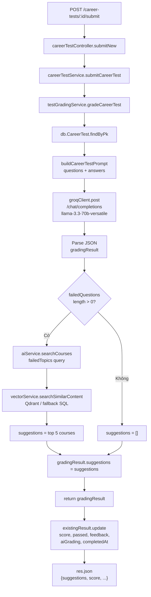

# Phase 1: Viết lại Logic Chấm Điểm Career Test bằng LLM + Vector Search

---

## 1. Phân tích hiện trạng

### 1.1 Logic mock if/else hiện tại

**Vị trí:** [`TLCN_GROUP7_BE/src/services/testGradingService.js`](d:\4th Year\Semester 2\2\MMS\TLCN_GROUP7_BE\src\services\testGradingService.js), method `gradeCareerTest` (dòng 269–376)

**Hàm chứa logic tạm bợ:**

```269:376:TLCN_GROUP7_BE/src/services/testGradingService.js
  async gradeCareerTest(testId, studentId, answers) {
    try {
      const careerTest = await db.CareerTest.findByPk(testId);
      if (!careerTest) throw new Error('Career test không tồn tại');

      const questions = careerTest.questions || [];
      if (!Array.isArray(questions) || questions.length === 0) {
        throw new Error('Career test không có câu hỏi nào');
      }

      let totalScore = 0;
      let totalPoints = 0;
      const details = [];

      for (const question of questions) {
        const points = question.points || 10;
        totalPoints += points;

        const studentAnswer = answers.find(a => a.questionIndex === questions.indexOf(question));

        if (!studentAnswer) { /* ... */ }

        let earnedPoints = 0;
        let isCorrect = false;
        let explanation = '';

        // === LOGIC MOCK BẮT ĐẦU TỪ ĐÂY ===

        if (question.type === 'MULTIPLE_CHOICE') {
          // Mock: so sánh string tuyến tính
          const normalizedCorrect = String(question.correctAnswer).toUpperCase().trim();
          const normalizedAnswer = String(studentAnswer.answer).toUpperCase().trim();
          isCorrect = normalizedCorrect === normalizedAnswer;
          earnedPoints = isCorrect ? points : 0;
        } else if (question.type === 'SHORT_ANSWER') {
          // Mock: keyword ratio cứng 0.7
          const expectedKeywords = question.expectedKeywords || [];
          const answerLower = String(studentAnswer.answer).toLowerCase();
          const matchedKeywords = expectedKeywords.filter(keyword =>
            answerLower.includes(String(keyword).toLowerCase())
          );
          const matchRatio = matchedKeywords.length / expectedKeywords.length;
          earnedPoints = Math.round(matchRatio * points * 100) / 100;
          isCorrect = matchRatio >= 0.7;
        }
        // === KẾT THÚC LOGIC MOCK ===

        totalScore += earnedPoints;
        details.push({ questionIndex, type, maxPoints, earnedPoints, isCorrect, explanation });
      }

      // TODO: Gợi ý courses cải thiện dựa trên câu hỏi sai qua aiService.searchCourses()
      // Sẽ được thêm ở Bước 2.7 khi hoàn thiện aiService.searchCourses()
```

### 1.2 Luồng dữ liệu hiện tại

```
POST /career-tests/:id/submit
  → careerTestController.submitNew
    → careerTestService.submitCareerTest
      → testGradingService.gradeCareerTest  ← THAY THẾ LOGIC Ở ĐÂY
        → existingResult.update({ aiGrading: gradingResult })
```

### 1.3 Schema liên quan

**Bảng `student_test_results`** (theo [database_schema.md](d:\4th Year\Semester 2\2\MMS\database_schema.md)):

| Trường | Kiểu | Ghi chú |
|--------|------|---------|
| `score` | FLOAT NULL | Điểm số |
| `passed` | BOOLEAN NULL | Đạt/không đạt |
| `feedback` | TEXT NULL | Nhận xét từ AI |
| `aiGrading` | JSON NULL | Kết quả chấm điểm đầy đủ (chứa `suggestions`) |
| `completedAt` | DATE NULL | Thời gian nộp |

---

## 2. Các bước thi công (Todos)

### Bước 1: Dọn dẹp logic cũ trong `gradeCareerTest`

**File:** `TLCN_GROUP7_BE/src/services/testGradingService.js`

**Mục tiêu:** Xóa toàn bộ vòng for chứa logic mock if/else (dòng 283–343) — phần xử lý `MULTIPLE_CHOICE` và `SHORT_ANSWER` bằng string comparison và keyword ratio cứng.

**Cụ thể cần xóa:**

- Dòng 279–280: khai báo `totalScore`, `totalPoints`
- Dòng 283–343: vòng `for (const question of questions)` — chứa toàn bộ logic mock
- Dòng 345–347: tính `finalScore` bằng tổng mock
- Dòng 349: `const correctCount`
- Dòng 351: `const feedback` string tạm
- Dòng 353–359: `failedQuestions` + `suggestions` string tạm
- Dòng 361–362: TODO comment

**Giữ nguyên:** phần `careerTest` lookup (dòng 271–277), phần try/catch, và return object structure (dòng 364–371) — KHÔNG xóa return.

**Kết quả:** Method `gradeCareerTest` sẽ chỉ còn trống ở phần xử lý, chờ được điền logic LLM.

---

### Bước 2: Thiết kế System Prompt cho LLM (Groq/Llama-3)

**File mới (hoặc inline):** `TLCN_GROUP7_BE/src/services/testGradingService.js` — khai báo constant `SYSTEM_PROMPT_CAREER_TEST` trong method `buildCareerTestPrompt` (hoặc viết trực tiếp trong `gradeCareerTest`)

**System Prompt cho Career Test — bắt buộc LLM trả JSON:**

```
Bạn là giáo viên chấm bài trắc nghiệm nghề nghiệp chuyên nghiệp.
Nhiệm vụ: chấm điểm bài test định hướng nghề nghiệp gồm 2 loại câu hỏi.

LOẠI CÂU HỎI VÀ CÁCH CHẤM:
1. MULTIPLE_CHOICE:
   - So sánh đáp án học sinh với đáp án đúng
   - Đúng: full điểm. Sai: 0 điểm.

2. SHORT_ANSWER:
   - So sánh nội dung câu trả lời với expectedKeywords hoặc expectedAnswer
   - Nếu có expectedKeywords: kiểm tra % từ khóa khớp, cho điểm theo tỉ lệ
   - Nếu không có expectedKeywords: đánh giá nội dung theo mức độ liên quan, logic, đầy đủ
   - FULL match: full điểm. PARTIAL: điểm theo tỉ lệ. IRRELEVANT: 0 điểm.

ĐẦU VÀO:
- questions: mảng câu hỏi [{id, type, question, correctAnswer?, expectedKeywords?, points}]
- studentAnswers: mảng câu trả lời [{questionIndex, answer}]

QUY TẮC TÍNH ĐIỂM:
- Điểm tối đa mỗi câu = question.points (mặc định 10)
- Điểm final = tổng điểm / tổng điểm tối đa * 100 (thang 100)

OUTPUT FORMAT — BẮT BUỘC JSON (không có text khác):
{
  "score": <number 0-100>,
  "correctCount": <number>,
  "totalQuestions": <number>,
  "feedback": "<nhận xét chung ngắn 1-3 câu>",
  "details": [
    {
      "questionIndex": <number>,
      "type": "<MULTIPLE_CHOICE|SHORT_ANSWER>",
      "maxPoints": <number>,
      "earnedPoints": <number>,
      "isCorrect": <boolean>,
      "explanation": "<giải thích ngắn 1-2 câu>"
    }
  ]
}

KHÔNG thêm field "suggestions" trong kết quả chấm điểm này.
"failedQuestions" sẽ được xử lý riêng ở bước Vector Search.
```

**User Prompt:** sử dụng `buildGradingPrompt` đã có, bổ sung format cho CareerTest (xem Bước 3).

---

### Bước 3: Tích hợp LLM vào `gradeCareerTest`

**File:** `TLCN_GROUP7_BE/src/services/testGradingService.js`

Thay thế logic mock đã xóa ở Bước 1 bằng đoạn code gọi Groq:

```javascript
async gradeCareerTest(testId, studentId, answers) {
  try {
    const careerTest = await db.CareerTest.findByPk(testId);
    if (!careerTest) throw new Error('Career test không tồn tại');

    const questions = careerTest.questions || [];
    if (!Array.isArray(questions) || questions.length === 0) {
      throw new Error('Career test không có câu hỏi nào');
    }

    // === BƯỚC 3: GỌI LLM (GROQ) ===
    const gradingPrompt = this.buildCareerTestPrompt(questions, answers);

    const response = await groqClient.post('/chat/completions', {
      model: 'llama-3.3-70b-versatile',
      messages: [
        {
          role: 'system',
          content: `Bạn là giáo viên chấm bài trắc nghiệm nghề nghiệp chuyên nghiệp...` // (prompt từ Bước 2)
        },
        { role: 'user', content: gradingPrompt }
      ],
      temperature: 0.3,
      max_tokens: 3000
    });

    const rawContent = response.data.choices[0].message.content;

    // Parse JSON
    let gradingResult;
    try {
      const jsonMatch = rawContent.match(/```json\n?([\s\S]*?)\n?```/) ||
                        rawContent.match(/```\n?([\s\S]*?)\n?```/) ||
                        rawContent.match(/(\{[\s\S]*\})/);
      const jsonStr = jsonMatch ? jsonMatch[1] : rawContent;
      gradingResult = JSON.parse(jsonStr);
    } catch (parseError) {
      console.error('[gradeCareerTest] Parse error:', parseError);
      throw new Error('Lỗi parse kết quả chấm điểm từ LLM');
    }

    // Validate required fields
    gradingResult.score = typeof gradingResult.score === 'number' ? gradingResult.score : 0;
    gradingResult.details = Array.isArray(gradingResult.details) ? gradingResult.details : [];
    gradingResult.feedback = gradingResult.feedback || 'Không có nhận xét';

    // === BƯỚC 4: VECTOR SEARCH (gọi ngay sau grading) ===
    const failedQuestions = gradingResult.details.filter(d => !d.isCorrect);
    let suggestions = [];

    if (failedQuestions.length > 0) {
      const aiService = require('./aiService');
      // Ghép nội dung câu hỏi sai thành query cho vector search
      const failedTopics = failedQuestions.map(fq => {
        const q = questions[fq.questionIndex];
        return q?.question || '';
      }).filter(Boolean).join(' ');

      if (failedTopics) {
        const courseResults = await aiService.searchCourses(failedTopics);
        suggestions = courseResults.slice(0, 5); // top 5 courses
      }
    }

    // Gắn suggestions vào kết quả
    gradingResult.suggestions = suggestions;

    return gradingResult;

  } catch (error) {
    console.error('[TestGradingService.gradeCareerTest] Error:', error);
    throw error;
  }
}
```

**Method `buildCareerTestPrompt` mới:**

```javascript
buildCareerTestPrompt(questions, studentAnswers) {
  let prompt = `Hãy chấm bài test định hướng nghề nghiệp sau:\n\n`;
  prompt += `Tổng số câu hỏi: ${questions.length}\n\n`;

  questions.forEach((q, index) => {
    prompt += `---\n`;
    prompt += `**CÂU ${index + 1}** (${q.points || 10} điểm) - Loại: ${q.type}\n`;
    prompt += `Câu hỏi: ${q.question}\n`;

    if (q.type === 'MULTIPLE_CHOICE') {
      prompt += `Các lựa chọn:\n`;
      q.options?.forEach((opt, i) => {
        prompt += `  ${String.fromCharCode(65 + i)}. ${opt}\n`;
      });
      prompt += `Đáp án đúng: ${q.correctAnswer}\n`;
    } else if (q.type === 'SHORT_ANSWER') {
      if (q.expectedAnswer) {
        prompt += `Đáp án mẫu: ${q.expectedAnswer}\n`;
      }
      if (q.expectedKeywords?.length > 0) {
        prompt += `Từ khóa cần có: ${q.expectedKeywords.join(', ')}\n`;
      }
    }

    const studentAnswer = studentAnswers.find(a => a.questionIndex === index);
    prompt += `\n**Câu trả lời của học sinh:** ${studentAnswer?.answer || '(Không có)'}\n`;
  });

  prompt += `\n---\n\nHãy chấm điểm và trả về kết quả theo format JSON yêu cầu.`;
  return prompt;
}
```

---

### Bước 4: Tích hợp Vector Search cho suggestions

**File:** `TLCN_GROUP7_BE/src/services/testGradingService.js` (bổ sung vào `gradeCareerTest`, xem Bước 3)

**Logic:**

1. Sau khi nhận kết quả LLM, trích xuất `failedQuestions` từ `gradingResult.details`
2. Với mỗi câu sai, lấy `questions[failedQuestion.questionIndex].question` (nội dung câu hỏi)
3. Nối các câu hỏi sai thành query string
4. Gọi `aiService.searchCourses(query)` — method đã tồn tại trong `aiService.js` (dòng 207–270), sử dụng `vectorService.searchSimilarContent` với Qdrant, fallback SQL LIKE
5. Giới hạn top 5 kết quả, map thành `suggestions` array
6. Gắn `suggestions` vào `gradingResult.suggestions` trước return

**Lưu ý:** Cần `require` đúng `aiService` (đã có sẵn trong codebase, KHÔNG cần viết thêm). Nếu `aiService.searchCourses` throw error, fallback về empty array `[]` để không block toàn bộ grading.

---

### Bước 5: Cập nhật Database — `StudentTestResult`

**File:** `TLCN_GROUP7_BE/src/services/careerTestService.js`, method `submitCareerTest` (dòng 207–253)

**Logic cập nhật hiện tại đã đúng cấu trúc — chỉ cần xác nhận không thay đổi:**

```javascript
await existingResult.update({
  answers,
  score: gradingResult.score || 0,
  passed: (gradingResult.score || 0) >= 60,
  feedback: gradingResult.feedback,
  aiGrading: gradingResult,    // ← JSON chứa suggestions (từ Bước 3-4)
  completedAt: new Date()
});
```

**Đối chiếu với schema `student_test_results`:**

| Trường | Kiểu trong schema | Giá trị ghi | Kiểm tra |
|--------|-------------------|-------------|---------|
| `score` | FLOAT NULL | `gradingResult.score` | Number ✓ |
| `passed` | BOOLEAN NULL | `score >= 60` | Boolean ✓ |
| `feedback` | TEXT NULL | `gradingResult.feedback` | String ✓ |
| `aiGrading` | JSON NULL | `gradingResult` (full object) | JSON ✓ |
| `completedAt` | DATE NULL | `new Date()` | Date ✓ |

**KHÔNG cần tạo migration** — schema hiện tại đã hỗ trợ đầy đủ các trường cần thiết.

---

### Bước 6: Cập nhật Controller trả response về frontend

**File:** `TLCN_GROUP7_BE/src/controllers/careerTestController.js` (method `submitNew`)

**Xác nhận response trả về có chứa `suggestions`:**

```javascript
// Trong careerTestController.submitNew:
return res.status(200).json({
  success: true,
  score: result.score,
  passed: result.passed,
  feedback: result.feedback,
  details: result.details,
  suggestions: result.suggestions   // ← field mới từ Bước 4
});
```

---

## 3. Tiêu chí nghiệm thu (Checklist)

```
[ ] 1. Logic mock if/else trong gradeCareerTest (testGradingService.js dòng 283–343) đã được xóa hoàn toàn.
[ ] 2. LLM (Groq llama-3.3-70b-versatile) được gọi thay vì so sánh string cứng.
[ ] 3. LLM trả về đúng JSON structure: { score, correctCount, totalQuestions, feedback, details[] }.
[ ] 4. JSON parsing an toàn (try/catch) với regex fallback nếu LLM bọc markdown.
[ ] 5. failedQuestions được trích xuất từ gradingResult.details dựa trên isCorrect === false.
[ ] 6. aiService.searchCourses() được gọi với query từ nội dung câu hỏi sai.
[ ] 7. suggestions (mảng courses từ vector search) được gắn vào gradingResult.suggestions.
[ ] 8. Endpoint POST /career-tests/:id/submit trả về HTTP 200 với JSON chứa field "suggestions".
[ ] 9. Bảng student_test_results được update đúng: score (FLOAT), passed (BOOLEAN), feedback (TEXT), aiGrading (JSON), completedAt (DATE).
[ ] 10. Nếu aiService.searchCourses throw error → suggestions fallback về [] (không break grading).
```

---

## 4. Sơ đồ luồng dữ liệu sau khi thay đổi



---

## 5. Các file cần thay đổi

| File | Hành động |
|------|-----------|
| `TLCN_GROUP7_BE/src/services/testGradingService.js` | Sửa method `gradeCareerTest` (Bước 1, 3, 4). Thêm method `buildCareerTestPrompt` (Bước 3) |
| `TLCN_GROUP7_BE/src/services/careerTestService.js` | Không thay đổi (logic update db đã đúng ở Bước 5) |
| `TLCN_GROUP7_BE/src/controllers/careerTestController.js` | Xác nhận `submitNew` trả đủ fields + `suggestions` (Bước 6) |