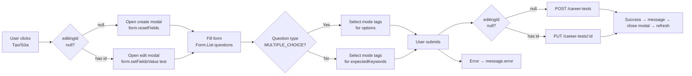

## 1. Xác định vị trí lưu plan

```
TLCN_GROUP_FE/src/pages/Company/company_careertest_manage.plan.md
```

---

## 2. Interfaces cần khai báo (trong file .tsx)

```typescript
// ─── TypeScript Interfaces ────────────────────────────────────────────────────

type QuestionType = "MULTIPLE_CHOICE" | "SHORT_ANSWER";

// Question payload — dùng cho cả POST lẫn PUT
export interface CareerTestQuestion {
  type: QuestionType;
  question: string;
  // MULTIPLE_CHOICE
  options?: string[];
  correctAnswer?: string;
  // SHORT_ANSWER
  expectedKeywords?: string[];
  // Cả hai loại
  points: number;
}

// GET /career-tests/owned trả về
export interface CareerTestListItem {
  id: string;
  title: string;
  description?: string;
  questions?: CareerTestQuestion[];
  createdAt: string;
  updatedAt?: string;
}

export interface CareerTestListResponse {
  total: number;
  page: number;
  limit: number;
  data: CareerTestListItem[];
}

// Payload gửi lên POST /career-tests và PUT /career-tests/:id
export interface CareerTestPayload {
  title: string;
  description?: string;
  questions: CareerTestQuestion[];
}
```

---

## 3. State Structure

```typescript
// ─── Table state ───────────────────────────────────────────────────────────────
const [tests, setTests]         = useState<CareerTestListItem[]>([]);
const [loading, setLoading]     = useState(true);
const [error, setError]         = useState<string | null>(null);
const [currentPage, setCurrentPage] = useState(1);
const [totalPages, setTotalPages]    = useState(1);
const [totalItems, setTotalItems]    = useState(0);
const PAGE_SIZE = 10;

// ─── Modal + Form state ────────────────────────────────────────────────────────
const [modalOpen, setModalOpen]       = useState(false);
const [editingId, setEditingId]      = useState<string | null>(null); // null = create, string = edit
const [submitLoading, setSubmitLoading] = useState(false);
const [form] = useForm<CareerTestPayload>();
// Watch question type per index
const questionTypes = Form.useWatch("questions", form) ?? [];
```

---

## 4. API Layer — dùng apiClient từ `../../services/apiClient`

```typescript
// ─── Fetch list ────────────────────────────────────────────────────────────────
const fetchTests = useCallback(async (page: number) => {
  try {
    setLoading(true);
    setError(null);
    const res = await apiClient.get<CareerTestListResponse>(
      `/career-tests/owned?page=${page}&limit=${PAGE_SIZE}`
    );
    // Anti-crash: 2-layer Optional Chaining fallback
    // Backend may wrap response as { data: { data, total } } or flat { data, total }
    const testList = res?.data?.data || res?.data || [];
    const totalCount = res?.data?.total || res?.total || 0;
    setTests(testList);
    setTotalItems(totalCount);
    setTotalPages(Math.ceil(totalCount / PAGE_SIZE));
    setCurrentPage(res?.page ?? page);
  } catch (err: any) {
    setError(err?.response?.data?.message || err?.message || "Không thể tải danh sách bài test.");
  } finally {
    setLoading(false);
  }
}, [PAGE_SIZE]);

// ─── Create ───────────────────────────────────────────────────────────────────
const handleCreate = async (values: CareerTestPayload) => {
  setSubmitLoading(true);
  try {
    // ── Sanitize payload: strip irrelevant fields per question type ──────────
    const sanitizedQuestions = (values.questions ?? []).map((q) => {
      const base = {
        type: q.type,
        question: q.question.trim(),
        points: q.points,
      };
      if (q.type === "MULTIPLE_CHOICE") {
        return {
          ...base,
          options: q.options ?? [],
          correctAnswer: q.correctAnswer,
        };
      } else {
        // SHORT_ANSWER — strip options and correctAnswer before sending
        const { options, correctAnswer, ...rest } = q as any;
        return { ...base, expectedKeywords: q.expectedKeywords ?? [] };
      }
    });

    await apiClient.post("/career-tests", {
      title: values.title.trim(),
      description: values.description?.trim(),
      questions: sanitizedQuestions,
    });
    message.success("Tạo bài test thành công!");
    setModalOpen(false);
    form.resetFields();
    fetchTests(currentPage);
  } catch (err: any) {
    message.error(err?.response?.data?.message || "Tạo bài test thất bại.");
  } finally {
    setSubmitLoading(false);
  }
};

// ─── Update ───────────────────────────────────────────────────────────────────
const handleUpdate = async (id: string, values: CareerTestPayload) => {
  setSubmitLoading(true);
  try {
    // ── Sanitize payload: strip irrelevant fields per question type ──────────
    const sanitizedQuestions = (values.questions ?? []).map((q) => {
      const base = {
        type: q.type,
        question: q.question.trim(),
        points: q.points,
      };
      if (q.type === "MULTIPLE_CHOICE") {
        return {
          ...base,
          options: q.options ?? [],
          correctAnswer: q.correctAnswer,
        };
      } else {
        // SHORT_ANSWER — strip options and correctAnswer before sending
        const { options, correctAnswer, ...rest } = q as any;
        return { ...base, expectedKeywords: q.expectedKeywords ?? [] };
      }
    });

    await apiClient.put(`/career-tests/${id}`, {
      title: values.title.trim(),
      description: values.description?.trim(),
      questions: sanitizedQuestions,
    });
    message.success("Cập nhật bài test thành công!");
    setModalOpen(false);
    setEditingId(null);
    form.resetFields();
    fetchTests(currentPage);
  } catch (err: any) {
    message.error(err?.response?.data?.message || "Cập nhật bài test thất bại.");
  } finally {
    setSubmitLoading(false);
  }
};

// ─── Delete ───────────────────────────────────────────────────────────────────
const handleDelete = async (id: string) => {
  try {
    await apiClient.delete(`/career-tests/${id}`);
    message.success("Xóa bài test thành công!");
    fetchTests(currentPage);
  } catch (err: any) {
    message.error(err?.response?.data?.message || "Xóa bài test thất bại.");
  }
};
```

---

## 5. Table UI (Antd-less, dùng native HTML table + Tailwind — giống CompanyJobManage)

```tsx
<table className="w-full">
  <thead>
    <tr className="bg-gray-50 border-b border-gray-200">
      <th className="text-left px-5 py-3 text-xs font-semibold text-gray-500 uppercase">Tiêu đề</th>
      <th className="text-left px-5 py-3 text-xs font-semibold text-gray-500 uppercase">Mô tả</th>
      <th className="text-center px-5 py-3 text-xs font-semibold text-gray-500 uppercase">Số câu hỏi</th>
      <th className="text-left px-5 py-3 text-xs font-semibold text-gray-500 uppercase">Ngày tạo</th>
      <th className="text-center px-5 py-3 text-xs font-semibold text-gray-500 uppercase">Thao tác</th>
    </tr>
  </thead>
  <tbody>
    {tests.map((test) => (
      <tr key={test.id} className="hover:bg-gray-50">
        <td className="px-5 py-4 text-sm font-medium text-gray-900">{test.title}</td>
        <td className="px-5 py-4 text-sm text-gray-500 truncate max-w-xs">
          {test.description || "—"}
        </td>
        <td className="px-5 py-4 text-center text-sm text-blue-600 font-medium">
          {test.questions?.length ?? 0}
        </td>
        <td className="px-5 py-4 text-sm text-gray-500">
          {formatDate(test.createdAt)}
        </td>
        <td className="px-5 py-4">
          <div className="flex items-center justify-center gap-1">
            {/* Edit */}
            <button onClick={() => openEditModal(test)} className="p-2 text-blue-600 hover:bg-blue-50 rounded-lg" title="Sửa">
              <Pencil className="w-4 h-4" />
            </button>
            {/* Delete with Popconfirm */}
            <Popconfirm
              title="Xóa bài test?"
              description="Hành động này không thể hoàn tác."
              onConfirm={() => handleDelete(test.id)}
              okText="Xóa"
              cancelText="Hủy"
              okButtonProps={{ danger: true }}
            >
              <button className="p-2 text-red-500 hover:bg-red-50 rounded-lg" title="Xóa">
                <Trash2 className="w-4 h-4" />
              </button>
            </Popconfirm>
          </div>
        </td>
      </tr>
    ))}
  </tbody>
</table>
```

**Pagination** — giống hệt `CompanyJobManage`: Previous/Next arrows + ellipsis page numbers.

---

## 6. Modal Form — Dynamic Form.List

**Trigger:**
- Header button "Tạo bài test mới" → `openCreateModal()`
- Edit icon in table row → `openEditModal(test)`

**Form structure (Antd `Form`):**
```tsx
<Form form={form} layout="vertical" onFinish={handleFormSubmit}>
  <Form.Item name="title" label="Tiêu đề"
    rules={[{ required: true, message: "Nhập tiêu đề bài test." }]}>
    <Input placeholder="VD: Bài test Định hướng nghề Frontend" />
  </Form.Item>

  <Form.Item name="description" label="Mô tả">
    <Input.TextArea rows={2} placeholder="Mô tả ngắn về bài test..." />
  </Form.Item>

  {/* ── Questions Form.List ─────────────────────────────────────────── */}
  <div className="mb-4">
    <label className="text-sm font-medium text-gray-700 mb-2 block">
      Câu hỏi ({questionTypes.length})
    </label>

    <Form.List name="questions">
      {(fields, { add, remove }) => (
        <>
          {fields.map(({ key, name, ...rest }) => {
            const qType = questionTypes[name]?.type ?? "MULTIPLE_CHOICE";
            return (
              <div key={key} className="mb-6 p-4 bg-gray-50 rounded-lg border border-gray-200">
                {/* ── Row 1: Type + Points ─────────────────────────────────── */}
                <div className="flex gap-3 mb-3">
                  <Form.Item
                    {...rest}
                    name={[name, "type"]}
                    initialValue="MULTIPLE_CHOICE"
                    className="flex-1 mb-0"
                  >
                    <Select>
                      <Select.Option value="MULTIPLE_CHOICE">Trắc nghiệm</Select.Option>
                      <Select.Option value="SHORT_ANSWER">Tự luận</Select.Option>
                    </Select>
                  </Form.Item>
                  <Form.Item
                    {...rest}
                    name={[name, "points"]}
                    initialValue={10}
                    className="w-32 mb-0"
                    rules={[{ required: true, message: "Điểm" }]}
                  >
                    <Input type="number" min={1} placeholder="Điểm" />
                  </Form.Item>
                  <Button type="text" danger onClick={() => remove(name)}>Xóa</Button>
                </div>

                {/* ── Row 2: Question text ────────────────────────────────── */}
                <Form.Item
                  {...rest}
                  name={[name, "question"]}
                  rules={[{ required: true, message: "Nhập nội dung câu hỏi." }]}
                >
                  <Input.TextArea rows={2} placeholder="Nội dung câu hỏi..." />
                </Form.Item>

                {/* ── MULTIPLE_CHOICE: options + correctAnswer ─────────────── */}
                {qType === "MULTIPLE_CHOICE" && (
                  <>
                    {/* options: BẮT BUỘC dùng Select mode="tags" */}
                    <Form.Item
                      {...rest}
                      name={[name, "options"]}
                      label="Các lựa chọn (A, B, C, D)"
                      rules={[{ required: true, message: "Thêm ít nhất 2 lựa chọn." }]}
                    >
                      <Select
                        mode="tags"
                        placeholder="Nhập từng lựa chọn, nhấn Enter sau mỗi lựa chọn"
                        tokenSeparators={[","]}
                        style={{ width: "100%" }}
                      />
                    </Form.Item>

                    {/* correctAnswer: Select từ options đã nhập */}
                    <Form.Item
                      {...rest}
                      name={[name, "correctAnswer"]}
                      label="Đáp án đúng"
                      rules={[{ required: true, message: "Chọn đáp án đúng." }]}
                    >
                      <Select
                        placeholder="Chọn đáp án đúng"
                        allowClear
                      >
                        {(questionTypes[name]?.options ?? []).map((opt: string) => (
                          <Select.Option key={opt} value={opt}>{opt}</Select.Option>
                        ))}
                      </Select>
                    </Form.Item>
                  </>
                )}

                {/* ── SHORT_ANSWER: expectedKeywords ────────────────────────── */}
                {qType === "SHORT_ANSWER" && (
                  <Form.Item
                    {...rest}
                    name={[name, "expectedKeywords"]}
                    label="Từ khóa chấm điểm"
                    rules={[{ required: true, message: "Thêm ít nhất 1 từ khóa." }]}
                  >
                    {/* BẮT BUỘC dùng Select mode="tags" */}
                    <Select
                      mode="tags"
                      placeholder="Nhập từ khóa cần có trong câu trả lời, nhấn Enter"
                      tokenSeparators={[","]}
                      style={{ width: "100%" }}
                    />
                  </Form.Item>
                )}
              </div>
            );
          })}

          <Button type="dashed" block onClick={() => add({
            type: "MULTIPLE_CHOICE",
            question: "",
            options: [],
            points: 10,
          })}>
            + Thêm câu hỏi
          </Button>
        </>
      )}
    </Form.List>
  </div>

  {/* ── Footer ──────────────────────────────────────────────────────── */}
  <div className="flex justify-end gap-3 mt-6 pt-4 border-t">
    <Button onClick={() => { setModalOpen(false); form.resetFields(); setEditingId(null); }}>
      Hủy
    </Button>
    <Button htmlType="submit" type="primary" loading={submitLoading}>
      {editingId ? "Cập nhật" : "Tạo bài test"}
    </Button>
  </div>
</Form>
```

---

## 7. Mermaid — Data Flow



---

## 8. Step-by-step Implementation Tasks

1. **Khai báo Interfaces** — `QuestionType`, `CareerTestQuestion`, `CareerTestListItem`, `CareerTestListResponse`, `CareerTestPayload` — đặt trước component.

2. **Thêm imports** — `apiClient` từ `../../services/apiClient`, Antd components (`Modal`, `Form`, `Input`, `Select`, `Popconfirm`, `message`), `useForm`, `lucide-react` icons (`Pencil`, `Trash2`, `Plus`, `ChevronLeft`, `ChevronRight`, `FileText`), `message` từ `antd`.

3. **Khai báo tất cả State** — `tests`, `loading`, `error`, `currentPage`, `totalPages`, `totalItems`, `modalOpen`, `editingId`, `submitLoading`, `form`, `questionTypes`.

4. **Viết helper functions** — `formatDate(dateStr: string)`.

5. **Viết `fetchTests` với Anti-Crash Optional Chaining** — `res?.data ?? []`, `res?.total ?? 0`.

6. **Viết handlers** — `handleCreate`, `handleUpdate`, `handleDelete`, `openCreateModal`, `openEditModal`.

7. **useEffect mount** — gọi `fetchTests(1)`.

8. **Build Header** — tiêu đề trang + nút "Tạo bài test mới".

9. **Build Table** — các cột Tiêu đề, Mô tả, Số câu hỏi (`test.questions?.length ?? 0`), Ngày tạo, Thao tác (Sửa + Xóa với `Popconfirm`). Trạng thái loading/error/empty tương tự `CompanyJobManage`.

10. **Build Pagination** — giống hệt `CompanyJobManage` (arrows + ellipsis).

11. **Build Modal** — `Modal` Antd với `Form.List` questions, `Select mode="tags"` cho `options` và `expectedKeywords`, `Form.useWatch` để reactive theo `type` mỗi câu hỏi.

12. **Wire Modal open/close** — `setModalOpen`, `setEditingId`, `form.resetFields`.

---

## 9. Các file liên quan

- **Target:** `TLCN_GROUP_FE/src/pages/Company/CompanyCareerTestManage.tsx`
- **Import apiClient:** `../../services/apiClient` (auto-wraps Bearer token)
- **Pattern tham khảo:** `TLCN_GROUP_FE/src/pages/Company/CompanyJobManage.tsx`
- **Form.List pattern tham khảo:** `TLCN_GROUP_FE/src/pages/Company/CompanyCourseEdit.tsx`
- **Antd components:** `Modal`, `Form`, `Input`, `Select`, `Popconfirm`, `message`
- **Icons:** `Pencil`, `Trash2`, `Plus`, `ChevronLeft`, `ChevronRight`, `FileText` (từ `lucide-react`)
