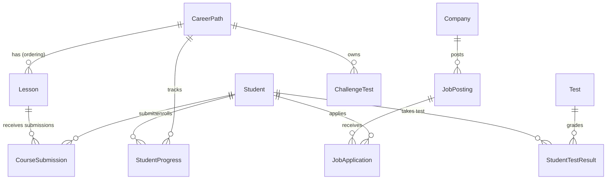

# MMS Feature Rebuild — Master Plan

---

## Phần 1: Database Topology

### 1.1 Bảng mới cần tạo

#### `Course` (mở rộng từ `CareerPath` — đổi tên context trong code)

File gốc: `TLCN_GROUP7_BE/src/models/careerPathModel.js`

- Thêm 4 cột mới (giữ nguyên tên bảng `CareerPaths` trong DB, chỉ đổi tên model variable trong code):


| Cột           | Kiểu                                       | Mô tả                                     |
| ------------- | ------------------------------------------ | ----------------------------------------- |
| `level`       | ENUM('BEGINNER','INTERMEDIATE','ADVANCED') | Cấp độ khoá học                           |
| `category`    | STRING                                     | Danh mục (VD: Backend, Frontend, DevOps…) |
| `publishedAt` | DATE                                       | Thời điểm publish                         |
| `isFeatured`  | TINYINT(1), default 0                      | Nổi bật trên trang chủ                    |


#### `Lesson` (mở rộng — gộp toàn bộ cột của CourseLesson)

File gốc: `TLCN_GROUP7_BE/src/models/lessonModel.js`
Thêm 8 cột mới vào bảng `Lessons` hiện có (Lesson vẫn giữ vai trò ordering/grouping trong CareerPath, đồng thời chứa toàn bộ nội dung bài giảng):


| Cột                   | Kiểu                  | Mô tả                                           |
| --------------------- | --------------------- | ----------------------------------------------- |
| `type`                | ENUM('TASK','THEORY') | Loại bài giảng                                  |
| `theoryContent`       | TEXT                  | Nội dung lý thuyết (bài đọc/blog-style)         |
| `taskDescription`     | TEXT                  | Mô tả đề bài task                               |
| `submissionFields`    | JSON                  | Cấu hình các ô nộp bài (xem bên dưới)           |
| `attachments`         | JSON                  | Danh sách file đính kèm {name, url, type, size} |
| `referenceLinks`      | JSON                  | Danh sách link tham khảo {title, url}           |
| `rubric`              | TEXT                  | Rubric chấm điểm (tham chiếu cho AI)            |
| `createdAt/updatedAt` |                       | Sequelize tự tạo                                |


**Cấu trúc `submissionFields` (JSON):**

```json
[
  { "id": "uuid", "type": "SQL_QUERY", "label": "Viết SQL truy vấn", "placeholder": "SELECT * FROM...", "required": true },
  { "id": "uuid", "type": "CODE", "label": "Code Python", "language": "python", "required": true },
  { "id": "uuid", "type": "EXPLANATION", "label": "Giải thích cách làm", "required": false }
]
```

#### `CourseSubmission` — Bảng mới cho bài nộp lesson


| Cột              | Kiểu                       | Mô tả                                                   |
| ---------------- | -------------------------- | ------------------------------------------------------- |
| `id`             | UUID (PK)                  | —                                                       |
| `studentId`      | UUID (FK → Student)        | Sinh viên nộp bài                                       |
| `lessonId`       | UUID (FK → Lesson)         | Bài học được nộp                                        |
| `careerPathId`   | UUID (FK → CareerPath)     | Khoá học chứa bài này                                   |
| `submissionData` | JSON                       | Dữ liệu các ô nộp bài {fieldId: value}                  |
| `score`          | DECIMAL(5,2)               | Điểm số                                                 |
| `aiGrading`      | JSON                       | Phân tích AI {score, feedback, strengths, improvements} |
| `status`         | ENUM('SUBMITTED','GRADED') | Trạng thái                                              |
| `submittedAt`    | DATE                       | Thời điểm nộp                                           |
| `gradedAt`       | DATE                       | Thời điểm chấm điểm                                     |


#### `JobPosting` — Bảng mới hoàn toàn


| Cột                   | Kiểu                                                  | Mô tả                                  |
| --------------------- | ----------------------------------------------------- | -------------------------------------- |
| `id`                  | UUID (PK)                                             | —                                      |
| `companyId`           | UUID (FK → Company)                                   | Doanh nghiệp đăng                      |
| `title`               | STRING                                                | Tên vị trí                             |
| `description`         | TEXT                                                  | Mô tả công việc                        |
| `skillRequirements`   | JSON                                                  | Danh sách skill yêu cầu (xem bên dưới) |
| `location`            | STRING                                                | Địa điểm                               |
| `salaryMin`           | DECIMAL                                               | Lương tối thiểu                        |
| `salaryMax`           | DECIMAL                                               | Lương tối đa                           |
| `employmentType`      | ENUM('FULL_TIME','PART_TIME','INTERNSHIP','CONTRACT') | Loại hình                              |
| `experienceLevel`     | ENUM('FRESHER','JUNIOR','MIDDLE','SENIOR')            | Cấp bậc kinh nghiệm                    |
| `deadline`            | DATE                                                  | Hạn nộp                                |
| `requiredDocuments`   | JSON                                                  | Danh sách document yêu cầu             |
| `status`              | ENUM('OPEN','CLOSED','DRAFT')                         | Trạng thái                             |
| `viewCount`           | INTEGER, default 0                                    | Lượt xem                               |
| `createdAt/updatedAt` |                                                       | Sequelize tự tạo                       |


**Cấu trúc `skillRequirements` (JSON):**

```json
[
  { "skillName": "Node.js", "level": "REQUIRED", "minProficiency": 3 },
  { "skillName": "MySQL", "level": "REQUIRED", "minProficiency": 2 },
  { "skillName": "Docker", "level": "NICE_TO_HAVE", "minProficiency": 1 }
]
```

#### `JobApplication` — Bảng mới cho đơn ứng tuyển


| Cột            | Kiểu                                                            | Mô tả               |
| -------------- | --------------------------------------------------------------- | ------------------- |
| `id`           | UUID (PK)                                                       | —                   |
| `jobPostingId` | UUID (FK → JobPosting)                                          | Job ứng tuyển       |
| `studentId`    | UUID (FK → Student)                                             | Sinh viên ứng tuyển |
| `coverLetter`  | TEXT                                                            | Thư ứng tuyển       |
| `status`       | ENUM('PENDING','REVIEWING','SHORTLISTED','REJECTED','ACCEPTED') | Trạng thái          |
| `appliedAt`    | DATE                                                            | Thời điểm nộp       |


**Unique constraint:** `(jobPostingId, studentId)` — mỗi SV chỉ nộp 1 lần/job.

---

### 1.2 Associations (Quan hệ khóa ngoại)




**Cụ thể từng quan hệ cần khai báo trong Sequelize model files:**


| Model                 | Association                                                                |
| --------------------- | -------------------------------------------------------------------------- |
| `CareerPath` (Course) | `hasMany(Lesson)`, `hasMany(StudentProgress)`, `hasMany(CourseSubmission)` |
| `Lesson`              | `belongsTo(CareerPath)`, `hasMany(CourseSubmission)`                       |
| `CourseSubmission`    | `belongsTo(Student)`, `belongsTo(Lesson)`, `belongsTo(CareerPath)`         |
| `JobPosting`          | `belongsTo(Company)`, `hasMany(JobApplication)`                            |
| `JobApplication`      | `belongsTo(JobPosting)`, `belongsTo(Student)`                              |
| `Student`             | `hasMany(CourseSubmission)`, `hasMany(JobApplication)`                     |


---

### 1.3 Sửa đổi model hiện có


| File                        | Thay đổi                                                               |
| --------------------------- | ---------------------------------------------------------------------- |
| `studentTestResultModel.js` | Thêm `lessonId` (FK nullable) — để test lesson có thể dùng chung model |
| `studentProgressModel.js`   | Thêm `currentLessonId` — track bài học hiện tại (khóa tiến độ)         |
| `studentProgressModel.js`   | Thêm `lastCompletedLessonId` — bài cuối đã hoàn thành                  |


---

## Phần 2: API Endpoints

### 2.1 Course Feature (Mở rộng từ CareerPath)

#### Authentication Middleware

Tất cả endpoint dưới đây đều dùng middleware `authenticate` (JWT). Role check được xử lý trong controller.

#### Company/Admin endpoints:


| Method   | Endpoint                                       | Input                                                                                           | Output                               |
| -------- | ---------------------------------------------- | ----------------------------------------------------------------------------------------------- | ------------------------------------ |
| `POST`   | `/courses`                                     | `{title, description, level, category, image, status}` + file ảnh                               | Course object                        |
| `PUT`    | `/courses/:id`                                 | `{title, description, level, category, status}`                                                 | Updated course                       |
| `DELETE` | `/courses/:id`                                 | —                                                                                               | `{message}`                          |
| `POST`   | `/courses/:courseId/lessons`                   | `{title, order}`                                                                                | Lesson object                        |
| `PUT`    | `/courses/:courseId/lessons/:lessonId`         | `{title, order}`                                                                                | Updated lesson                       |
| `DELETE` | `/courses/:courseId/lessons/:lessonId`         | —                                                                                               | `{message}`                          |
| `PUT`    | `/courses/:courseId/lessons/:lessonId/content` | `{type, theoryContent, taskDescription, submissionFields, attachments, referenceLinks, rubric}` | Lesson object (with extended fields) |
| `GET`    | `/courses/owned`                               | `page, limit` (auth: COMPANY/ADMIN)                                                             | Paginated list of company's courses  |
| `PATCH`  | `/courses/:id/publish`                         | —                                                                                               | Updated course with `publishedAt`    |


#### Student endpoints:


| Method | Endpoint                                        | Input                                  | Output                                                           |
| ------ | ----------------------------------------------- | -------------------------------------- | ---------------------------------------------------------------- |
| `GET`  | `/courses`                                      | `page, limit, category, level, search` | Paginated public courses                                         |
| `GET`  | `/courses/:id`                                  | —                                      | Course detail + lessons + first incomplete lesson                |
| `POST` | `/courses/:id/enroll`                           | —                                      | StudentProgress object                                           |
| `GET`  | `/courses/:id/progress`                         | —                                      | Progress with all lesson statuses                                |
| `GET`  | `/courses/:courseId/lessons/:lessonId`          | —                                      | Lesson detail (with type, submissionFields, attachments, rubric) |
| `POST` | `/courses/:courseId/lessons/:lessonId/submit`   | `{submissionData}`                     | CourseSubmission object + AI grading                             |
| `POST` | `/courses/:courseId/lessons/:lessonId/complete` | —                                      | Updated StudentProgress (theory lesson — đánh dấu hoàn thành)    |


#### Admin endpoints (ngoài các endpoint Company):


| Method   | Endpoint             | Input                 | Output                           |
| -------- | -------------------- | --------------------- | -------------------------------- |
| `GET`    | `/admin/courses`     | `page, limit, status` | All courses (kể cả chưa publish) |
| `PATCH`  | `/admin/courses/:id` | `{status}`            | Updated course                   |
| `DELETE` | `/admin/courses/:id` | —                     | `{message}`                      |


---

### 2.2 Career Path (Test) Feature

#### Company/Admin endpoints:


| Method   | Endpoint                    | Input                                              | Output                            |
| -------- | --------------------------- | -------------------------------------------------- | --------------------------------- |
| `POST`   | `/career-tests`             | `{title, description, questions[], careerPathId?}` | CareerTest object                 |
| `PUT`    | `/career-tests/:id`         | `{title, description, questions[]}`                | Updated CareerTest                |
| `DELETE` | `/career-tests/:id`         | —                                                  | `{message}`                       |
| `GET`    | `/career-tests/owned`       | `page, limit`                                      | Company's owned career tests      |
| `GET`    | `/career-tests/:id/results` | —                                                  | All student results for this test |


**Cấu trúc `questions[]` trong input:**

```json
[
  { "type": "MULTIPLE_CHOICE", "question": "...", "options": ["A","B","C","D"], "correctAnswer": "B", "points": 10 },
  { "type": "SHORT_ANSWER", "question": "...", "expectedKeywords": ["keyword1","keyword2"], "points": 20 }
]
```

#### Student endpoints:


| Method | Endpoint                   | Input                 | Output                           |
| ------ | -------------------------- | --------------------- | -------------------------------- |
| `GET`  | `/career-tests`            | `page, limit, search` | Paginated career tests           |
| `GET`  | `/career-tests/:id`        | —                     | Test detail (hide correctAnswer) |
| `POST` | `/career-tests/:id/enroll` | —                     | StudentProgress object           |
| `POST` | `/career-tests/:id/submit` | `{answers[]}`         | AI grading result + suggestions  |


**Cấu trúc `answers[]` trong input:**

```json
[
  { "questionIndex": 0, "answer": "B" },
  { "questionIndex": 1, "answer": "Sử dụng JOIN để ghép hai bảng..." }
]
```

#### Admin endpoints:


| Method   | Endpoint                  | Input         | Output              |
| -------- | ------------------------- | ------------- | ------------------- |
| `GET`    | `/admin/career-tests`     | `page, limit` | All career tests    |
| `PATCH`  | `/admin/career-tests/:id` | `{status}`    | Updated career test |
| `DELETE` | `/admin/career-tests/:id` | —             | `{message}`         |


---

### 2.3 Job Posting Feature (Tính năng hoàn toàn mới)

#### Company endpoints:


| Method   | Endpoint                            | Input                                                                                                                                     | Output                        |
| -------- | ----------------------------------- | ----------------------------------------------------------------------------------------------------------------------------------------- | ----------------------------- |
| `POST`   | `/jobs`                             | `{title, description, skillRequirements[], location, salaryMin, salaryMax, employmentType, experienceLevel, deadline, requiredDocuments}` | JobPosting object             |
| `PUT`    | `/jobs/:id`                         | Partial job object                                                                                                                        | Updated JobPosting            |
| `DELETE` | `/jobs/:id`                         | —                                                                                                                                         | `{message}`                   |
| `PATCH`  | `/jobs/:id/status`                  | `{status}`                                                                                                                                | Updated JobPosting            |
| `GET`    | `/jobs/owned`                       | `page, limit`                                                                                                                             | Company's posted jobs         |
| `GET`    | `/jobs/:id/applications`            | —                                                                                                                                         | All applications for this job |
| `PATCH`  | `/jobs/applications/:applicationId` | `{status}`                                                                                                                                | Updated application           |


#### Student endpoints:


| Method | Endpoint                  | Input                                                            | Output                               |
| ------ | ------------------------- | ---------------------------------------------------------------- | ------------------------------------ |
| `GET`  | `/jobs`                   | `page, limit, search, location, experienceLevel, employmentType` | Paginated job listings               |
| `GET`  | `/jobs/:id`               | —                                                                | Job detail + skill gap analysis      |
| `POST` | `/jobs/:id/apply`         | `{coverLetter}`                                                  | JobApplication object                |
| `GET`  | `/jobs/applied`           | —                                                                | Jobs student has applied to          |
| `GET`  | `/jobs/:id/learning-path` | —                                                                | Suggested courses based on skill gap |


**Output của `GET /jobs/:id` (thêm trường `skillGap`):**

```json
{
  "job": { ... },
  "skillGap": {
    "required": [{ "skillName": "Node.js", "matched": true, "proficiency": 4, "minRequired": 3 },
                 { "skillName": "MySQL", "matched": false }],
    "niceToHave": [{ "skillName": "Docker", "matched": false }]
  },
  "matchPercentage": 50
}
```

**Output của `GET /jobs/:id/learning-path`:**

```json
{
  "mustLearn": [{ "courseId": "uuid", "courseTitle": "...", "lessons": [...] }],
  "niceToKnow": [{ "courseId": "uuid", "courseTitle": "...", "lessons": [...] }]
}
```

#### Public endpoints:


| Method | Endpoint       | Input                 | Output                                 |
| ------ | -------------- | --------------------- | -------------------------------------- |
| `GET`  | `/jobs/market` | `page, limit, search` | Job listings with featured skills tags |


#### Admin endpoints:


| Method   | Endpoint          | Input         | Output      |
| -------- | ----------------- | ------------- | ----------- |
| `GET`    | `/admin/jobs`     | `page, limit` | All jobs    |
| `DELETE` | `/admin/jobs/:id` | —             | `{message}` |
| `PATCH`  | `/admin/jobs/:id` | `{status}`    | Updated job |


---

### 2.4 AI Grading Endpoints (Mở rộng từ existing)

#### AI cho bài TASK lesson:

`POST /courses/:courseId/lessons/:lessonId/submit`

- Service: Tạo prompt gửi Groq, đọc `submissionFields` + `rubric` từ Lesson để chấm từng ô
- AI phân tích: điểm từng phần, tổng điểm, feedback, điểm mạnh, điểm cần cải thiện
- Lưu vào `CourseSubmission.aiGrading`

#### AI chat cho từng bài học (4 vai trò):

Mở rộng existing `chatService.js` — thêm param `lessonContext`:

- `GET /courses/:courseId/lessons/:lessonId/chat/session` — tạo/get chat session gắn với lesson
- `POST /courses/:courseId/lessons/:lessonId/chat/message` — gửi message với context bài học
  - System prompt chọn vai: Manager / TechLead / HR / QA
  - Gửi kèm lesson content + submissionFields + rubric từ Lesson
- Role selection: query param `role=MANAGER|TECH_LEAD|HR|QA`

#### AI cho Career Test (mở rộng existing `testGradingService.js`):

- Giữ nguyên flow hiện tại cho bài test thuộc lesson
- Thêm `gradeCareerTest(testId, answers)` cho bài test độc lập (CareerTest)
- Sau khi chấm xong: gợi ý courses dựa trên câu hỏi sai qua vector search

---

## Phần 3: Trình tự thực thi

### Phase 1: Database & Models (Thực hiện TRƯỚC TIÊN — nền tảng cho mọi thứ)

**Bước 1.1:** Mở rộng model `Lesson` — thêm 8 cột mới

- File: `TLCN_GROUP7_BE/src/models/lessonModel.js`
- Thêm: `type`, `theoryContent`, `taskDescription`, `submissionFields`, `attachments`, `referenceLinks`, `rubric`
- Cập nhật associations: `hasMany(CourseSubmission)`

**Bước 1.2:** Tạo model `CourseSubmission`

- File: `TLCN_GROUP7_BE/src/models/courseSubmissionModel.js`
- FK: `lessonId` (→ Lesson), `studentId` (→ Student), `careerPathId` (→ CareerPath)
- Đăng ký trong `models/index.js`
- Khai báo đầy đủ associations

**Bước 1.3:** Tạo model `JobPosting` và `JobApplication`

- File: `TLCN_GROUP7_BE/src/models/jobPostingModel.js`
- File: `TLCN_GROUP7_BE/src/models/jobApplicationModel.js`
- Đăng ký trong `models/index.js`
- Khai báo associations

**Bước 1.4:** Sửa `studentTestResultModel.js` — thêm `lessonId` (FK nullable)
**Bước 1.5:** Sửa `studentProgressModel.js` — thêm `currentLessonId`, `lastCompletedLessonId`
**Bước 1.6:** Chạy migration (nếu có) hoặc điều chỉnh `sequelize.sync({ alter: true })`

> **Quy tắc:** Phase 1 phải xong hoàn toàn TRƯỚC khi chuyển sang Phase 2. Không skip bước nào.

---

### Phase 2: Backend Services & Controllers

**Bước 2.1:** Tạo `courseService.js` — tách từ `careerPathService.js` hiện có

- Giữ nguyên logic cũ, thêm: update lesson content (PUT lesson/content), submit lesson task, complete theory lesson
- Ownership check: Company chỉ sửa/xoá course của mình
- Khi update lesson content: ghi trực tiếp vào các cột mới của Lesson (`type`, `theoryContent`, `taskDescription`, `submissionFields`, `attachments`, `referenceLinks`, `rubric`)

**Bước 2.2:** Tạo `courseController.js` — HTTP handlers cho tất cả course endpoints

- Tái sử dụng middleware `upload` đã có cho ảnh course và file đính kèm

**Bước 2.3:** Tạo `careerTestService.js` — service cho career test (mở rộng từ test logic cũ)

- Tạo/cập nhật questions (lưu JSON array)
- Grading cho MULTIPLE_CHOICE + SHORT_ANSWER

**Bước 2.4:** Mở rộng `testGradingService.js` — thêm method `gradeCareerTest`

- Sau khi grading: gọi `aiService.searchCourses()` để gợi ý courses cải thiện

**Bước 2.5:** Tạo `jobPostingService.js`

- CRUD job posting với ownership check
- `applyForJob()` — ghi JobApplication, kiểm tra chưa ứng tuyển
- `analyzeSkillGap(studentId, jobPostingId)` — đọc skillRequirements + StudentProgress + StudentTestResult → trả skill gap
- `suggestLearningPath(skillRequirements)` — map skill → course via keyword matching

**Bước 2.6:** Tạo `jobPostingController.js` — HTTP handlers

**Bước 2.7:** Mở rộng `aiService.js` — thêm method `gradeLessonTask(submissionData, rubric, submissionFields)`

- Prompt gửi Groq: phân tích từng ô nộp, cho điểm, feedback chi tiết

**Bước 2.8:** Mở rộng `chatService` (hoặc tạo `lessonChatService.js`)

- Tạo chat session riêng cho từng lesson với role selection

---

### Phase 3: Routes

**Bước 3.1:** Tạo `courseRoute.js` — gom nhóm `/courses`, `/admin/courses`
**Bước 3.2:** Tạo `careerTestRoute.js` — gom nhóm `/career-tests`, `/admin/career-tests`
**Bước 3.3:** Tạo `jobRoute.js` — gom nhóm `/jobs`, `/admin/jobs`
**Bước 3.4:** Cập nhật `routes/index.js` — đăng ký 3 router mới

---

### Phase 4: Skill Gap & Learning Path Logic

**Bước 4.1:** Hoàn thiện `analyzeSkillGap()` trong `jobPostingService.js`

- Đọc `skillRequirements` từ JobPosting
- Đọc skill history từ StudentProgress + StudentTestResult (để tạm dùng keyword matching)
- Trả về: required skills matched/unmatched + nice-to-have

**Bước 4.2:** Hoàn thiện `suggestLearningPath()` trong `jobPostingService.js`

- Từ danh sách skill thiếu → gọi `aiService.searchCourses()` với keyword
- Map course → lesson → gợi ý

> **Lưu ý:** Phần skill mapping sẽ dùng keyword matching đơn giản (so sánh title/description) thay vì tạo thêm bảng Skill — phù hợp với ràng buộc Zero Over-engineering.

---

### Phase 5: Frontend (Sau khi backend API hoàn tất)

Frontend structure đề xuất (trong `TLCN_GROUP_FE/src/`):

```
pages/
  Course/
    CourseListPage.tsx        # Public + filter (category, level)
    CourseDetailPage.tsx      # Course info + lesson list + enroll
    CourseStudyPage.tsx       # Học bài: hiển thị theory OR task form
    MyCoursesPage.tsx         # Enrolled courses
  Company/
    CompanyCourseManage.tsx  # Owned courses + create/edit
    CompanyCourseEdit.tsx    # Design lessons + content
    CompanyJobManage.tsx     # Job postings + create/edit
    CompanyCareerTestManage.tsx
  Admin/
    AdminCoursePage.tsx      # Quản lý tất cả courses
    AdminJobPage.tsx         # Quản lý tất cả jobs
    AdminCareerTestPage.tsx
  Job/
    JobMarketPage.tsx        # /jobs/market — public listing
    JobDetailPage.tsx        # Job detail + skill gap + apply
    MyApplicationsPage.tsx   # Jobs đã ứng tuyển
```

> **Frontend không nằm trong phạm vi code thực thi của plan này** — chỉ mô tả cấu trúc để lập trình viên reference.

---

### Dependency Graph

```
Phase 1 (Models)
    │
    ├── Phase 2a (courseService + courseController)
    ├── Phase 2b (careerTestService + testGradingService extension)
    ├── Phase 2c (jobPostingService + jobPostingController)
    └── Phase 2d (aiService extension + chatService extension)
              │
              └── Phase 3 (Routes — tất cả 3 route cùng lúc)
                        │
                        └── Phase 4 (Skill gap logic — sau routes)
                                  │
                                  └── Phase 5 (Frontend — sau khi API xong)
```

